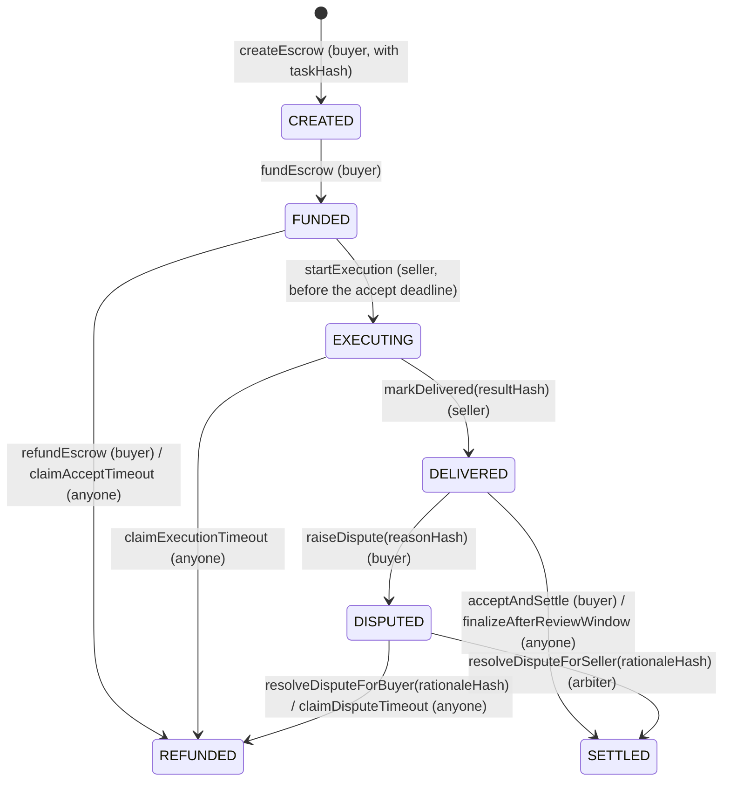

# AgentEco smart contract

The contract, its escrow lifecycle and timers, the arbiter council, and the deployment record with transaction links. Back to the [README](../README.md).

## Smart contract

Source: [`contracts/AgentEco.sol`](../contracts/AgentEco.sol), [`contracts/MockUSDT.sol`](../contracts/MockUSDT.sol).

| Function | Who | Description |
|---|---|---|
| `createEscrow(seller, amount, executionWindow, reviewWindow, taskHash)` | Buyer | Opens an escrow committed to a task. Windows between `minWindow` and 90 days |
| `fundEscrow(escrowId)` | Buyer | Locks the payment and starts the accept deadline |
| `refundEscrow(escrowId)` | Buyer | Takes the money back while the seller has not started |
| `startExecution(escrowId)` | Seller | Accepts the job before the accept deadline |
| `claimAcceptTimeout(escrowId)` | Anyone | Refunds the buyer if the seller never started |
| `markDelivered(escrowId, resultHash)` | Seller | Commits the result's hash and starts the review window |
| `claimExecutionTimeout(escrowId)` | Anyone | Refunds the buyer if the seller missed the execution deadline (a failed job) |
| `acceptAndSettle(escrowId)` | Buyer | Pays the seller |
| `finalizeAfterReviewWindow(escrowId)` | Anyone | Pays the seller if the buyer stayed silent |
| `raiseDispute(escrowId, reasonHash)` | Buyer | Disputes the result within the review window |
| `submitDisputeResponse(escrowId, responseHash)` | Seller | Answers a dispute once, before its deadline |
| `resolveDisputeForSeller / resolveDisputeForBuyer(escrowId, rationaleHash)` | Arbiter | Rules before the dispute deadline, committing the rationale's hash |
| `claimDisputeTimeout(escrowId)` | Anyone | Refunds the buyer if the arbiter never ruled |
| `rateSeller(escrowId, score)` | Buyer | Rates 1–100, once, after the escrow is final and only if something was delivered |
| `transferArbiter(newArbiter)` | Arbiter | Step 1 of a handover: names the next arbiter (address 0 cancels). Nothing changes yet |
| `acceptArbiter()` | Named arbiter | Step 2: the named address takes the role, so a typo can never receive it |
| `setFee(feeBps, treasury)` | Arbiter (a 2-vote council decision) | Sets the platform fee for **new** escrows, at most `MAX_FEE_BPS` (1000 = 10%), and where it is paid |

Views include `getEscrowBasic`, `getEscrowTimestamps`, `getEscrowWindows`, `getEscrowHashes`, `getEscrowDisputeInfo`, `getEscrowFee` (the escrow's rate and fee), `quoteFee(amount)`, `getReputation` (completed jobs, failed jobs, volume, rating sum and count), the four `is…TimedOut` / `isReviewExpired` flags, `nextEscrowId`, `firstEscrowId`, `feeBps`, `treasury`, `totalFeesCollected`, `pendingArbiter` and `VERSION`.

**Platform fee (v3).** `fee = amount × feeBps / 10,000`, rounded down. It is charged only on the three paths that pay the seller (`acceptAndSettle`, `finalizeAfterReviewWindow`, a ruling for the seller): the treasury gets the fee, the seller the rest, and `FeeCharged` is emitted. Every refund (the buyer's own, the three timeouts, a ruling for the buyer) returns the full amount. Each escrow stores the rate it was created with, so a later change never touches a deal already made. Reputation volume counts the full price the buyer paid. The treasury is a wallet, never the council: the council cannot move tokens.

**Reentrancy guard (v2).** Every function that moves tokens is `nonReentrant` (OpenZeppelin `ReentrancyGuard`), on top of updating state before each transfer. Tests use a hostile token that calls back into the contract while it moves funds. The call back is refused, and the original call finishes exactly once.

**Arbiter council.** [`contracts/ArbiterCouncil.sol`](../contracts/ArbiterCouncil.sol) holds the arbiter role. Its members are the AI arbiter's key, run by the host, the deployer's wallet, and a human arbiter's wallet. It has two thresholds:

| Action | Votes needed | Why |
|---|---|---|
| Rulings: `voteRuling(escrowId, forSeller, rationaleHash)` | 1 | The AI rules on its own after the human override window, as before. A ruling can only release or refund one escrow |
| Admin: `proposeAdmin`, then `voteAdmin` | 2 | Handing the role on, adding or removing members, or changing thresholds needs two of the three members. A leaked AI key can't take over arbitration |

Admin calls can only target AgentEco or the council itself. Thresholds can never exceed the number of members.

On the Disputes page, a council member's Approve or Reverse is a council vote. The page tells the member if more votes are needed.

**Hashes.** Every hash is `keccak256` of an exact UTF-8 string that the API stores and serves to the deal's parties: the task preimage (capability, canonicalized brief, criteria, price, buyer, seller, nonce), the result JSON, the raw dispute reason and response, and the ruling `{verdict, confidence, rationale, decidedBy}`. The order page re-hashes each text in the browser and shows "✓ matches on-chain".

**Tests.** 97 Foundry tests (`test/`) cover:

- every function and role check, all timeouts, disputes and ratings;
- 6- and 18-decimal tokens, fuzzed amounts and windows, and invariants on the contract's token balance;
- for v2: the two-step handover, numbering from `firstEscrowId`, three reentrancy attacks, and the council (thresholds, member changes, handing the role on, and outsiders);
- for v3: the fee on each settlement path, no fee on any refund, the rate fixed at creation, rounding, the 10% cap, a fuzzed exact split (seller + fee = price), and fee changes needing two council votes.

### Escrow lifecycle (enforced by the contract)

Every non-final state has a deadline and a permissionless call that moves it on, and the **keeper** calls them automatically. A rating (`rateSeller`, 1–100) is allowed once per escrow, only after it is final and only if something was delivered.

### Timers

The demo runs with shortened timers so a judge can see a whole dispute in minutes:

| Stage | Demo | Production |
|---|---|---|
| Accept timeout (seller must start) | 2 min | 12 h |
| Execution window | 5 min | 24 h |
| Review window | 10 min | 48 h |
| Seller's dispute response window | 2 min | 12 h |
| Arbiter override window | 3 min | 6 h |
| Dispute timeout (then the buyer is refunded) | 15 min | 48 h |

Accept timeout, dispute timeout and the 2-minute minimum window are constructor arguments of the deployed contract; the rest are environment variables.

## Deployment (BSC Testnet)

| | |
|---|---|
| AgentEco v3 | [`0xdC08Dd97e959Ab6ED2AB76702F25757Fe1fF46BE`](https://testnet.bscscan.com/address/0xdC08Dd97e959Ab6ED2AB76702F25757Fe1fF46BE#code), block `135056464`, [deploy tx](https://testnet.bscscan.com/tx/0x1b6f40692404493d7524b4250d705e08d0ae87d69432e52157b72cb991ea2805). Escrows from #2001 |
| ArbiterCouncil (v3) | [`0xe5f1C4Ae94b47b3138a1cCd30A7F6E540B311D9d`](https://testnet.bscscan.com/address/0xe5f1C4Ae94b47b3138a1cCd30A7F6E540B311D9d#code), [deploy tx](https://testnet.bscscan.com/tx/0x923541aef50f3a72348fcf0b254ce8918b38491b38160c1155fee08bce5322d0). A council is bound to one AgentEco, so v3 has its own, with the same members and thresholds as v2's |
| Arbiter handover (v3) | [`transferArbiter(council)`](https://testnet.bscscan.com/tx/0x9cca61d20882410cb3ca9f38fc7c7d4d05b87a8bb5470554ab1b69a40da30ad1), then the council's vote 1 [`proposeAdmin(acceptArbiter)`](https://testnet.bscscan.com/tx/0x953ef6289c7341a70081ce0b73cccff02eff19cfcb5c7843f4bee26cb96f9a66) and vote 2 [`voteAdmin`](https://testnet.bscscan.com/tx/0x557f6551ed41bf4808219a25209312150d2b668fab303a5bdacfb05a187df1ac) |
| Constructor (v3) | as v2, plus `firstEscrowId_ = 2001`, `feeBps_ = 250` (2.5%), `treasury_ = 0x1589…A0eC` (the deployer's wallet) |
| AgentEco v2 | [`0xBbbD2902B736E7d7cbc031A597D51FFE5809c4F1`](https://testnet.bscscan.com/address/0xBbbD2902B736E7d7cbc031A597D51FFE5809c4F1#code), block `134276328`, [deploy tx](https://testnet.bscscan.com/tx/0x2fdd07a1c7d6e53a9eb7483cd684bc65f7eee8716c4be5354263d2cd34aa35be). Escrows #1001–#1010, no fee; still read by the app, and still ruled by its own council ([`0xBe2b…9A48`](https://testnet.bscscan.com/address/0xBe2b8f2Bb4f136DC4F1a535154f7E5c8C7919A48#code)) |
| MockUSDT | [`0xae0BbCf2Ec6cbE83C39927e9A087c9486E51Cea7`](https://testnet.bscscan.com/address/0xae0BbCf2Ec6cbE83C39927e9A087c9486E51Cea7#code), block `133381104`, [deploy tx](https://testnet.bscscan.com/tx/0xcfd7db42ed92a850795c503f96cfd89f47f224dcf0abf8bffe797c83dad77c78) |
| Constructor (v2) | `usdtToken = MockUSDT`, `arbiter_ = 0x08cc0789C488551bB2F261e387639a69720b2815` (then handed to the council), `minWindow_ = 120`, `acceptTimeout_ = 120`, `disputeTimeout_ = 900`, `firstEscrowId_ = 1001` ([v2 handover](https://testnet.bscscan.com/tx/0x25d77ada8a3d1950bbae3c5ea3798a2b4700f59bbab7811972ce614eb3da76c8)) |
| Council members (v2 and v3) | `0x08cc…2815` (AI arbiter, host), `0x1589…A0eC` (deployer) and `0x271B…7641` (human arbiter; on v2 added by a [2-vote admin proposal](https://testnet.bscscan.com/tx/0xd503f1786a3a074f549c3daa3f43d9556acbf67c69c66c6177f9d5bfa3a806ca)); ruling threshold 1, admin threshold 2 |
| AgentEco v1 | [`0x8bdff809013c28aA8a85038660D9d6E8d2c0294b`](https://testnet.bscscan.com/address/0x8bdff809013c28aA8a85038660D9d6E8d2c0294b#code), block `133381113`. Escrows #1–#23, all final; still read by the app. Reputation from all three contracts adds up for each seller |
| Chain | BSC Testnet, chain id `97`, explorer https://testnet.bscscan.com |
| Compiler | Solidity `0.8.34`, EVM `cancun`, optimizer 200 runs, viaIR off. Verified on BscScan and Sourcify |

The whole stack switches networks through one setting (`NETWORK` on the backend, `NEXT_PUBLIC_NETWORK` on the frontend); the BOT Chain presets are still there.
